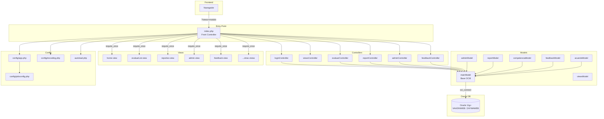
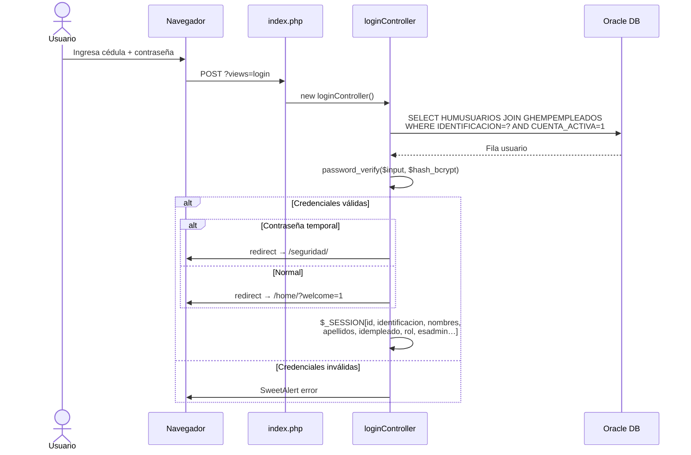

# ARQUITECTURA.md — Sistema GestionHumana
> **Clínica Zayma SAS** · Módulo de Evaluación de Desempeño V2  
> Versión del documento: 1.0 · Fecha: 2026-05-14

---

## 1. Visión General

GestionHumana es una aplicación web PHP desarrollada con un **framework MVC artesanal** (sin Laravel ni Symfony). Usa un único punto de entrada (`index.php`), enrutamiento por query-string, acceso directo a Oracle vía OCI8, y una capa de conversión de encoding UTF-8 ↔ Windows-1252.

```
┌─────────────────────────────────────────────────────────────────┐
│  NAVEGADOR (HTML/CSS/JS + Tailwind + SweetAlert2 + Preline UI) │
└───────────────────┬─────────────────────────────────────────────┘
                    │ HTTP (?views=modulo)
┌───────────────────▼─────────────────────────────────────────────┐
│  index.php — Front Controller único                             │
│  · Carga config/app.php, autoload.php, session_start.php        │
│  · Intercepta AJAX antes del DOCTYPE                            │
│  · Enruta a Controller según $url[0]                            │
└──────┬────────────┬───────────┬────────────┬─────────┬──────────┘
       │            │           │            │         │
  loginCtrl   viewsCtrl   evaluarCtrl  reportCtrl  adminCtrl
  feedbackCtrl
       │            │           │            │         │
┌──────▼────────────▼───────────▼────────────▼─────────▼──────────┐
│  Capa de Modelos (todos heredan de mainModel)                    │
│  mainModel · adminModel · reportModel · competenciaModel         │
│  feedbackModel · acuerdoModel · viewsModel                       │
└───────────────────────────────────┬─────────────────────────────┘
                                    │ OCI8 (oci_connect / oci_parse)
┌───────────────────────────────────▼─────────────────────────────┐
│  Oracle Database · HOST 10.2.202.215:1521/dinamica               │
│  Schemas: VAADINWEB (tablas HUM*) · ZAYMAWEB (tablas GH*)        │
└─────────────────────────────────────────────────────────────────┘
```

---

## 2. Patrón MVC Implementado

| Capa | Responsabilidad | Archivos principales |
|------|-----------------|---------------------|
| **Modelo** | Acceso a datos Oracle (OCI8), consultas SQL, lógica de negocio | `app/models/*.php` |
| **Vista** | HTML + PHP embebido, sin lógica de negocio pesada | `app/views/content/*-view.php` |
| **Controlador** | Recibe HTTP, orquesta modelos, pasa datos a vista | `app/controllers/*.php` |

> **Nota arquitectónica crítica:** Todos los controladores extienden `mainModel` directamente (`class adminController extends mainModel`). Esto viola la separación de capas MVC, pero es el patrón establecido en todo el proyecto.

---

## 3. Enrutamiento

```
URL:  http://host/GestionHumana/?views=evaluarList
       ─────────────────────────────┬────────────
                                    │
index.php  →  $url = explode("/", $_GET['views'])
           →  $url[0] = "evaluarList"
           →  viewsController::getViewsController("evaluarList")
           →  viewsModel::getViewsModel("evaluarList")   ← whitelist check
           →  return path "app/views/content/evaluarList-view.php"
```

### Lista blanca de vistas (viewsModel)

| Ruta `?views=` | Vista cargada |
|---------------|---------------|
| `home` | `home-view.php` |
| `login` / `index` | `login-view.php` |
| `evaluarList` | `evaluarList-view.php` |
| `autoEvaluacion` | `autoevaluacion-view.php` |
| `subEvaluacion` | `subEvaluacion-view.php` |
| `evaluacionLiderazgo` | `evaluacionLiderazgo-view.php` |
| `reportes` | `reportes-view.php` ← renderizado por reportController |
| `feedback` | `feedback-view.php` ← renderizado por feedbackController |
| `admin` | `admin-view.php` ← renderizado por adminController |
| `seguridad` | `seguridad-view.php` |
| `experienciaAzulColab` | `experienciaAzulColab-view.php` |
| `experienciaAzulLider` | `experienciaAzulLider-view.php` |

### Interceptores AJAX en index.php

index.php intercepta peticiones AJAX **antes** del `<!DOCTYPE html>` para evitar que el JSON quede envuelto en HTML:

| Acción | Módulo | Método |
|--------|--------|--------|
| `getCorreo` (POST) | login | Devuelve email enmascarado |
| `setEAEvaluado` (POST) | evaluación | Guarda id en sesión |
| `buscarEmpleadoCedula` (GET, XHR) | admin | Devuelve datos de empleado |
| `getCompetenciasMejora` / `getPlanColaborador` / `asignarAcuerdos` / `guardarPlanAccion` (GET/POST XHR) | reportes | CRUD acuerdos y planes |
| Cualquier XHR a `feedback` | feedback | CRUD feedback |

---

## 4. Estructura de Directorios

```
GestionHumana/
├── index.php                    ← Front controller, enrutador principal
├── autoload.php                 ← PSR-0 manual via spl_autoload_register
├── icons.php                    ← Helper global icon()
├── exportar.php                 ← Script de exportación standalone (legacy)
├── activarCuenta.php            ← Endpoint activación de cuenta
├── config/
│   ├── app.php                  ← APP_URL, APP_NAME, timezone
│   ├── pdoconfig.php            ← Credenciales Oracle (DB_HOST, DB_USER…)
│   └── encoding.php             ← Funciones toOracleEncoding / fromOracleEncoding
├── app/
│   ├── controllers/
│   │   ├── loginController.php
│   │   ├── viewsController.php
│   │   ├── evaluarController.php
│   │   ├── reportController.php
│   │   ├── adminController.php
│   │   └── feedbackController.php
│   ├── models/
│   │   ├── mainModel.php        ← Clase base: conectar(), limpiarCadena(), helpers UTF-8
│   │   ├── viewsModel.php       ← Whitelist de vistas
│   │   ├── adminModel.php       ← Períodos, usuarios, competencias, objetivos
│   │   ├── reportModel.php      ← Consultas de resultados y seguimiento
│   │   ├── competenciaModel.php ← Escala, opciones, respuestas, confirmaciones
│   │   ├── feedbackModel.php    ← Feedback, firma, acuerdos lider
│   │   ├── acuerdoModel.php     ← Acuerdos de mejora, planes de acción
│   │   └── EncodingModel.php    ← Helpers encoding adicionales
│   ├── views/
│   │   ├── inc/
│   │   │   ├── session_start.php   ← Inicia sesión PHP con flags seguros
│   │   │   ├── head.php            ← <head> HTML, CDN assets
│   │   │   ├── header.php          ← Sidebar lateral colapsable
│   │   │   ├── footer.php          ← Scripts cierre
│   │   │   └── nav.php             ← (legacy, reemplazado por header.php)
│   │   ├── content/               ← Una vista por módulo
│   │   ├── css/                   ← Tailwind minificado, styles.min.css
│   │   └── js/                    ← ajax.js, tabs.js, theme.js, preline.js…
│   └── ajax/
│       ├── formulariosAjax.php    ← AJAX legacy (formularios)
│       └── formAjax.php           ← AJAX legacy (adicional)
```

---

## 5. Capa de Base de Datos

### Conexión

```php
// config/pdoconfig.php
const DB_HOST     = '10.2.202.215';
const DB_PORT     = '1521';
const DB_NAME     = 'dinamica';
const DB_USER     = 'zaymaweb';
const DB_PASSWORD = 'zaymaweb';

// mainModel::conectar()
$cadena = "(DESCRIPTION=(ADDRESS=(PROTOCOL=TCP)(HOST=$host)(PORT=$port))
            (CONNECT_DATA=(SID=$dbname)))";
$conn = oci_connect($user, $pass, $cadena);
```

> **Problema crítico:** Las credenciales están en texto plano en `config/pdoconfig.php`. No hay variables de entorno ni archivo `.env`.

### Schemas Oracle utilizados

| Schema | Propósito | Tablas clave |
|--------|-----------|-------------|
| `VAADINWEB` | Datos del sistema de evaluación | `HUMUSUARIOS`, `HUMPERIODOEVALUACION`, `HUMEMPLEADOEVAL`, `HUMRESPUESTA`, `HUMCOMPETENCIA`, `HUMESCALA`, `HUMFEEDBACK` |
| `ZAYMAWEB` | Datos maestros de nómina/RRHH | `GHEMPEMPLEADOS`, `GHEMPUBICACION`, `GHEMPCARGOS`, `GHEMPCONTRATACIONES`, `GEGENERICA` |

### Tablas principales

| Tabla | Descripción |
|-------|-------------|
| `VAADINWEB.HUMUSUARIOS` | Usuarios del sistema (login, rol, admin, contraseña bcrypt) |
| `VAADINWEB.HUMPERIODOEVALUACION` | Períodos de evaluación (apertura, cierre, estado activo) |
| `VAADINWEB.HUMEMPLEADOEVAL` | Empleados habilitados para evaluación, jerarquía, roles |
| `VAADINWEB.HUMRESPUESTA` | Respuestas de evaluación (por competencia, por tipo, confirmadas) |
| `VAADINWEB.HUMCOMPETENCIA` | Catálogo de competencias dinámico |
| `VAADINWEB.HUMESCALA` | Escalas de calificación |
| `VAADINWEB.HUMOPCIONESCALA` | Opciones por escala (valor, etiqueta, orden) |
| `VAADINWEB.HUMOPCIONCOMPETENCIA` | Opciones específicas por competencia (tooltips) |
| `VAADINWEB.HUMROLCOMPETENCIA` | Relación rol ↔ competencia ↔ tipo de evaluación |
| `VAADINWEB.HUMROL` | Roles: Asistencial(1), Colaborador(2), Líder(3)… |
| `VAADINWEB.HUMDIMENSION` | Dimensiones de agrupación |
| `VAADINWEB.HUMFEEDBACK` | Sesiones de feedback lider→colaborador |
| `VAADINWEB.HUMOBJETIVOMEJORA` | Objetivos de mejora disponibles |
| `VAADINWEB.HUMACUERDOMEJORA` | Acuerdos de mejora asignados a colaboradores |
| `ZAYMAWEB.GHEMPEMPLEADOS` | Maestro de empleados (nómina) |
| `ZAYMAWEB.GHEMPUBICACION` | Ubicación/área funcional de empleado |
| `ZAYMAWEB.GHEMPCARGOS` | Cargos y nivel de cargo (`CODNIVELCARGO`) |
| `ZAYMAWEB.GHEMPCONTRATACIONES` | Contratos (fecha ingreso, estado) |

### Procedimiento almacenado de notificaciones

```sql
BEGIN ZAYMAWEB.PKT_NOTIFICACION_MAIL.SEND_MAIL_RECORDATORIO(
  :destino,   -- IDEMPLEADO destinatario
  :ref,       -- IDEMPLEADO de referencia (colaborador)
  :tipo       -- 'COLABORADOR' | 'LIDER'
); END;
```

### Encoding

Oracle almacena datos en `WE8MSWIN1252` (Windows-1252). PHP y el navegador trabajan en `UTF-8`. La capa de conversión es:

```
Lectura:   Oracle → fromOracleEncoding() → PHP/HTML (UTF-8)
Escritura: HTML (UTF-8) → toOracleEncoding() → Oracle bind
```

---

## 6. Diagrama de Componentes (Mermaid)



---

## 7. Diagrama de Flujo de Autenticación (Mermaid)



---

## 8. Diagrama de Flujo MVC (Mermaid)

```mermaid
flowchart LR
    REQ([HTTP Request\n?views=X]) --> IDX[index.php]
    IDX --> AJAX{¿Es AJAX\nantes de HTML?}
    AJAX -->|Sí| CTRL_AJAX[Controller directo\n→ json_encode → exit]
    AJAX -->|No| AUTH{¿Sesión válida?}
    AUTH -->|No| LOGIN[redirect /login/]
    AUTH -->|Sí| VC[viewsController\ngetViewsController]
    VC --> VM[viewsModel\nwhitelist check]
    VM -->|Ruta válida| CTRL[Controller específico]
    VM -->|Ruta inválida| V404[404-view.php]
    CTRL --> MODEL[Model(s)\nconsultas OCI8]
    MODEL --> ORA[(Oracle)]
    ORA --> MODEL
    MODEL --> DATA[array \$data]
    DATA --> VIEW[Vista PHP\nextract\(\$data\)\nrequire_once]
    VIEW --> HTML([HTML Response])
```

---

## 9. Tipos de Evaluación del Sistema

| Código | Descripción | Actor evaluador | Actor evaluado |
|--------|-------------|-----------------|----------------|
| `AUTO` | Autoevaluación | Empleado | Sí mismo |
| `LIDER_A_COLAB` | Evaluación de desempeño | Líder funcional | Colaborador directo |
| `COLAB_A_LIDER` | Evaluación de liderazgo | Colaborador | Su jefe directo |
| `EXPERIENCIA_COLAB` | Experiencia Azul (colaborador) | Líder | Colaborador asistencial (IDROL=1) |
| `EXPERIENCIA_LIDER` | Experiencia Azul (lider) | Colaborador asistencial | Su líder |

---

## 10. Niveles de Cargo y Roles

| Código | Nivel | Descripción |
|--------|-------|-------------|
| `NC001` | 1 | Asistencial / Colaborador base |
| `NC002` | 2 | Líder de primer nivel |
| `NC003` | 3 | Líder de segundo nivel |
| `NC004` | 4 | Directivo |
| `NC005` | 5 | Alta dirección |

| IDROL | Nombre |
|-------|--------|
| 1 | Asistencial |
| 2 | Colaborador |
| 3 | Líder funcional |

---

## 11. Deuda Técnica y Riesgos

| # | Tipo | Descripción | Severidad |
|---|------|-------------|-----------|
| 1 | Seguridad | Credenciales Oracle en texto plano (`pdoconfig.php`) | **Crítica** |
| 2 | Arquitectura | Controllers extienden mainModel (viola separación MVC) | Alta |
| 3 | Seguridad | `loginController` usa interpolación directa en SQL de login | Alta |
| 4 | Rendimiento | header.php abre conexión Oracle en cada carga de página para notificaciones (4-5 queries) | Media |
| 5 | Mantenimiento | Lógica de negocio mezclada en vistas (`home-view.php` hace queries directas con `ReflectionMethod`) | Media |
| 6 | Seguridad | `FILTER_SANITIZE_STRING` deprecado en PHP 8.1+ | Media |
| 7 | Mantenimiento | Múltiples instancias de `new reportModel()` y `new acuerdoModel()` dentro de `reportController` | Baja |
| 8 | Rendimiento | Sin pool de conexiones (cada request abre y cierra conexión OCI8) | Media |
| 9 | Mantenimiento | SQL construido con concatenación de string en `loginController` | Alta |
| 10 | Portabilidad | Dependencia dura a OCI8 (no hay capa PDO o abstracción) | Media |
