# FLUJOS DEL SISTEMA — GestionHumana
> **Clínica Zayma SAS** · Diagramas técnicos y funcionales  
> Versión: 1.0 · Fecha: 2026-05-14

---

## 1. Arquitectura General del Sistema

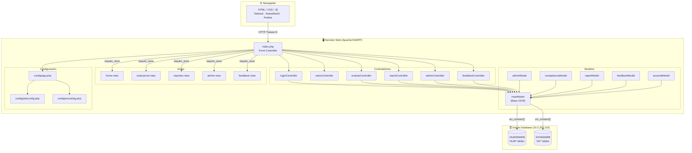

---

## 2. Flujo de Autenticación y Login

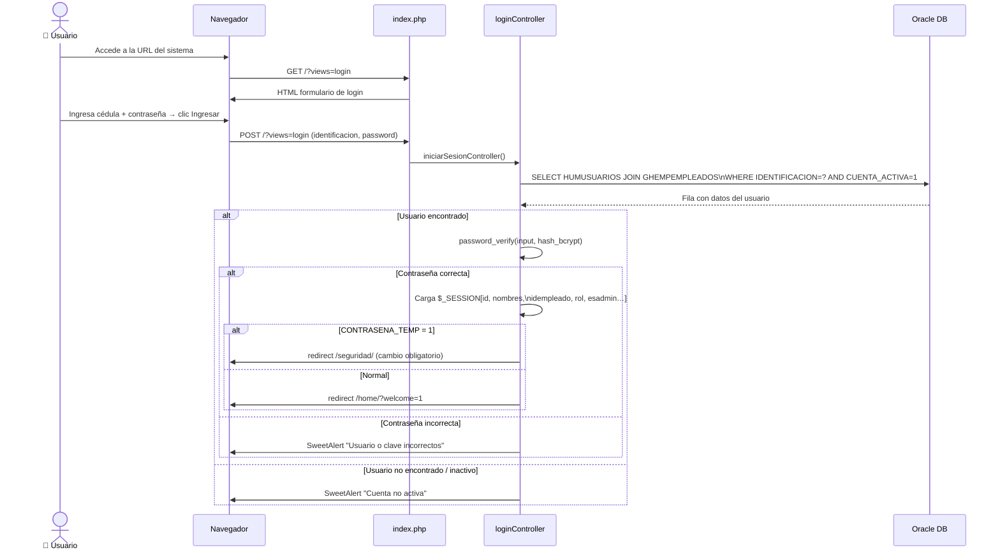

---

## 3. Flujo MVC — Petición Estándar (GET página)

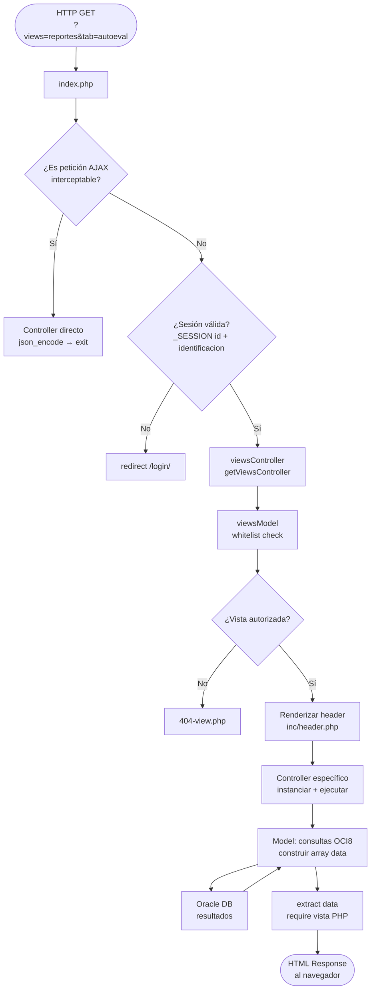

---

## 4. Flujo de Evaluación — Guardar Respuestas

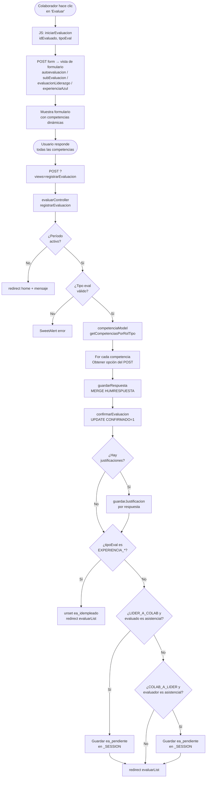

---

## 5. Flujo de Navegación del Usuario (por módulo)

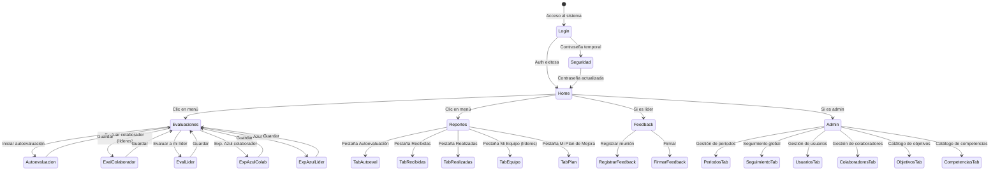

---

## 6. Flujo Frontend → Backend → Base de Datos

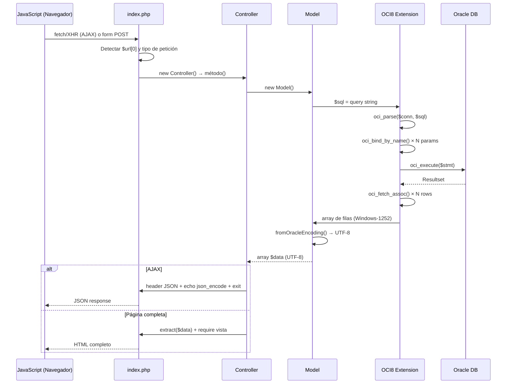

---

## 7. Relación entre Módulos

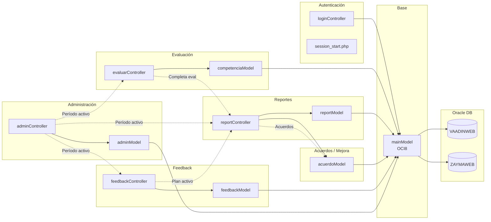

---

## 8. Flujo de Consultas SQL por Módulo

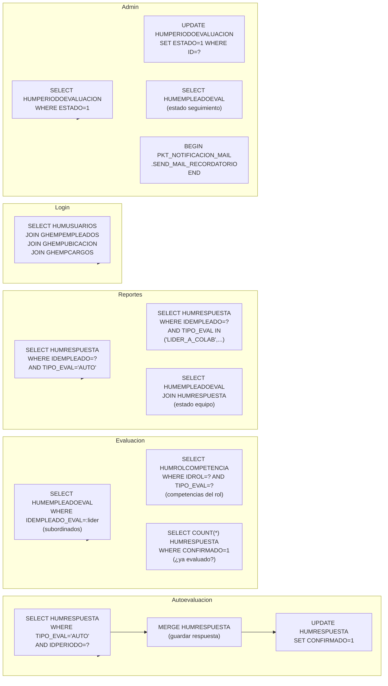

---

## 9. Dependencias Principales del Sistema

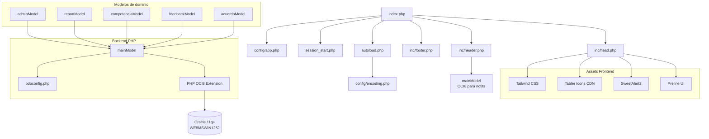

---

## 10. Flujo del Proceso de Evaluación Completo (Vista Funcional)

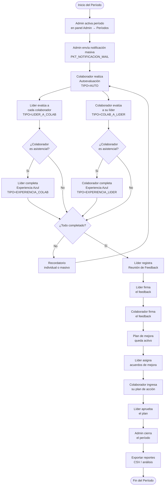

---

## 11. Flujo de Notificaciones

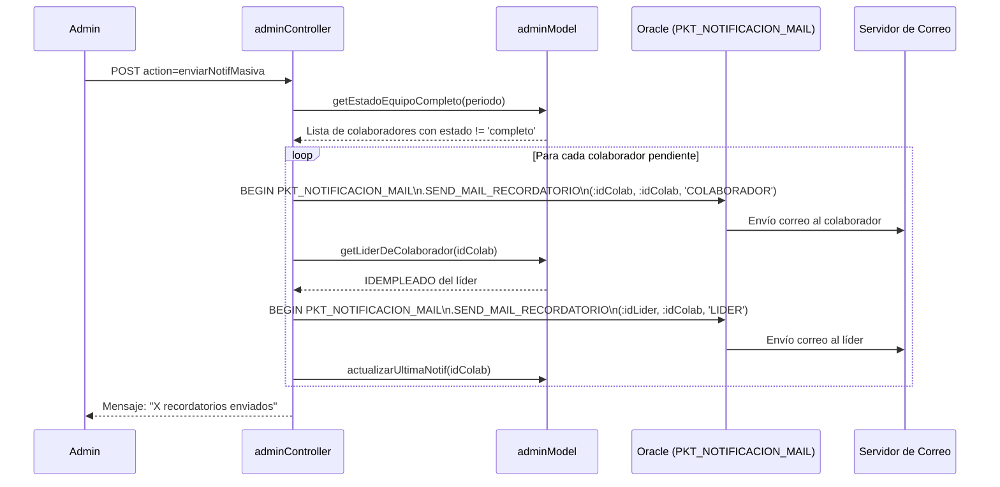

---

## 12. Flujo de Exportación CSV

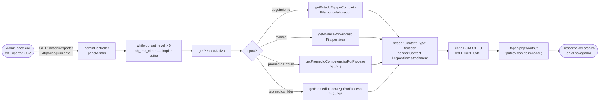

---

## 13. Flujo de Seguridad de Sesión

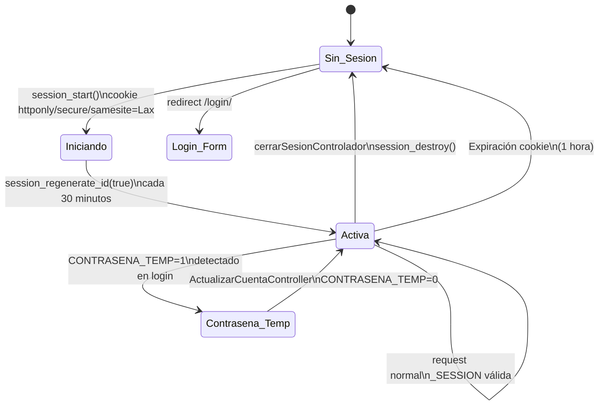
