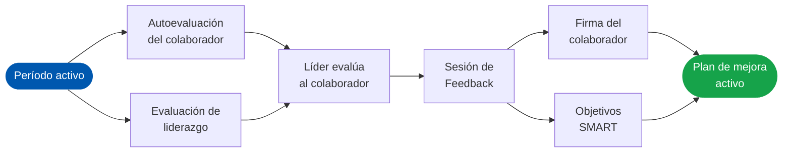
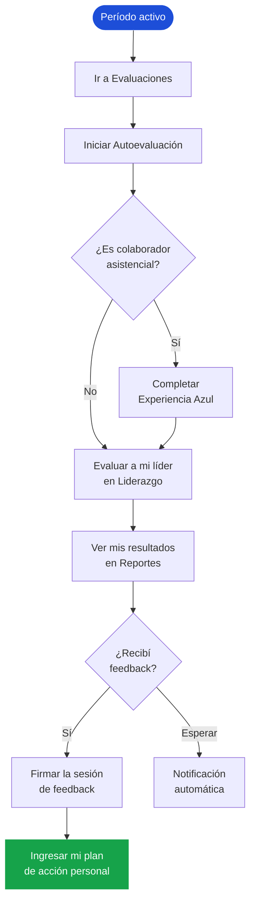
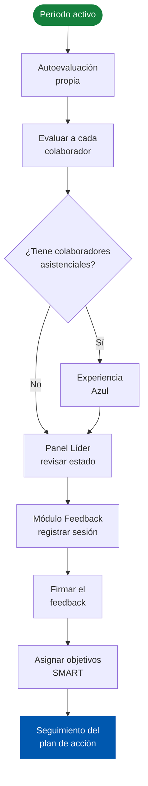

# Manual de Usuario — Evaluación de Desempeño
> **Clínica Zayma SAS** · Plataforma de Evaluación de Desempeño
> Versión 2.0 · Actualizado: 2026-05-26

---

## ¿Cuál es su perfil?

Seleccione su rol para ir directamente a su guía personalizada:

  
  <a class="mu-role-card" href="#a-id-lider">
    
<i class="ti ti-users" style="color:#15803d;"></i>

    
Líder Funcional

    
Evalúo a mi equipo, registro el feedback y asigno objetivos SMART.

    
<i class="ti ti-arrow-right"></i> Ver mi guía

  </a>
  <a class="mu-role-card" href="#a-id-director">
    
<i class="ti ti-crown" style="color:#6d28d9;"></i>

    
Director

    
Adicional al rol de Líder, doy feedback de liderazgo a mis líderes a cargo.

    
<i class="ti ti-arrow-right"></i> Ver mi guía

  </a>
  <a class="mu-role-card" href="#a-id-admin">
    
<i class="ti ti-settings" style="color:#b91c1c;"></i>

    
Administrador

    
Gestiono períodos, monitoreo el avance global y administro la plataforma.

    
<i class="ti ti-arrow-right"></i> Ver mi guía

  </a>

---

## Visión general del sistema

**Evaluación de Desempeño** es la plataforma digital de Clínica Zayma SAS para gestionar el proceso de evaluación de sus colaboradores. Integra directamente con el sistema de nómina institucional, garantizando que solo el personal activo y con la antigüedad requerida acceda.

  

    
<i class="ti ti-clipboard-check" style="color:#0058af;"></i>

    

Evaluación por competencias

Autoevaluación, evaluación de líderes y de colaboradores según perfil de cargo.

  

  

    
<i class="ti ti-message-circle" style="color:#16a34a;"></i>

    

Feedback formal

Registro estructurado de la reunión de retroalimentación con firma digital de ambas partes.

  

  

    
<i class="ti ti-target" style="color:#d97706;"></i>

    

Planes de mejora SMART

Objetivos específicos, medibles y accionables asignados al colaborador tras el feedback.

  

  

    
<i class="ti ti-chart-histogram" style="color:#7c3aed;"></i>

    

Analítica e indicadores

Reportes por competencia, rankings, brechas y seguimiento de acuerdos para directivos y admins.

  

### El proceso de evaluación — panorama completo

---

## Primeros pasos

### Activar mi cuenta por primera vez

Si es la primera vez que accede a la plataforma, debe activar su cuenta antes de iniciar sesión.

<ol class="mu-steps">
  <li class="mu-step">
    
1

    

      
Abrir el sistema en su navegador

      
Use Chrome, Edge o Firefox. Ingrese a la URL del sistema proporcionada por Gestión Humana
      o, de manera predeterminada, desde la Intranet de la institución, seleccionando el ícono “Evaluación de Desempeño”.

    

  </li>
  <li class="mu-step">
    
2

    

      
Hacer clic en "Activar mi cuenta"

      
En la pantalla de inicio de sesión encontrará esta opción debajo del formulario principal.

    

  </li>
  <li class="mu-step">
    
3

    

      
Ingresar su cédula y crear una contraseña

      
La contraseña debe tener mínimo 6 caracteres. El sistema verifica que usted esté activo en nómina.

    

  </li>
  <li class="mu-step mu-step-done">
    
<i class="ti ti-check" style="font-size:14px;"></i>

    

      
Su cuenta queda activa de inmediato

      
Puede iniciar sesión en ese momento. No es necesaria ninguna aprobación adicional.

    

  </li>
</ol>

> ⚠ **Nota:** Si aparece el mensaje "No cumple el tiempo mínimo", es porque tiene menos de 90 días de antigüedad en nómina. Contacte a Gestión Humana si considera que es un error.

### Iniciar sesión

1. Ingrese su **número de cédula** en el campo de identificación.
2. Ingrese su **contraseña**.
3. Haga clic en **"Ingresar"**.

> ⚠ **Contraseña temporal:** Si un administrador reseteó su contraseña, el sistema le pedirá cambiarla de forma obligatoria en el primer ingreso.

### Cambiar mi contraseña

Vaya a **Seguridad** en el menú lateral. Ingrese su cédula y la nueva contraseña, luego haga clic en **"Actualizar"**. El cambio es inmediato.

### Cerrar sesión

Haga clic en el ícono de salida (<i class="ti ti-logout" style="font-size:14px;vertical-align:middle;"></i>) en la parte inferior del menú lateral, junto a su nombre y foto de perfil.

---

## Navegación del sistema

El sistema cuenta con un **menú lateral** fijo a la izquierda. Puede colapsarlo haciendo clic en el botón **`«`** para ganar espacio en pantalla — en modo colapsado, los íconos siguen siendo clickeables.

| Módulo | Disponible para |
|--------|-----------------|
| <i class="ti ti-home"></i> **Inicio** | Todos los usuarios |
| <i class="ti ti-clipboard-check"></i> **Evaluaciones** | Todos los usuarios |
| <i class="ti ti-message-circle"></i> **Feedback** | Líderes funcionales y administradores |
| <i class="ti ti-chart-bar"></i> **Reportes** | Todos los usuarios |
| <i class="ti ti-layout-dashboard"></i> **Panel Líder** | Líderes funcionales y administradores |
| <i class="ti ti-shield-lock"></i> **Seguridad** | Todos los usuarios |
| <i class="ti ti-settings"></i> **Admin** | Solo administradores |
| <i class="ti ti-chart-histogram"></i> **Analítica** | Solo administradores |

### Notificaciones

El ícono de campana <i class="ti ti-bell" style="font-size:14px;vertical-align:middle;"></i> en la esquina superior derecha muestra alertas contextuales:

- **Autoevaluación pendiente** — no ha completado su autoevaluación del período activo.
- **Feedback pendiente de firma** — *(solo líderes)* tiene sesiones de feedback pendientes de firmar con el colaborador.
- **Colaboradores sin evaluar** — *(solo líderes)* tiene evaluaciones de equipo pendientes.
- **Feedback sin registrar** — *(solo líderes)* hay colaboradores sin sesión de feedback documentada.

### Tour de ayuda interactivo

En cada módulo encontrará un botón ? en la esquina inferior derecha de la pantalla. Al hacer clic se activa un **tour guiado paso a paso** que explica cada elemento del módulo. También puede iniciarlo desde el mismo botón en la barra superior derecha.

> ✅ **Recomendación:** Use el tour la primera vez que acceda a un módulo nuevo. Es la forma más rápida de entender su funcionamiento.

---

## Colaborador — Guía completa

  
<i class="ti ti-user"></i>

  

    
Su recorrido en el proceso

    
Autoevaluación · Evaluar a su líder · Reportes · Plan de mejora

  

### Su flujo paso a paso

### Realizar la autoevaluación

La autoevaluación es el **primer paso obligatorio** del proceso. Sin ella, su líder no puede completar la evaluación ni el feedback.

1. Vaya a **Evaluaciones** en el menú lateral.
2. En la sección **"Mi evaluación"**, haga clic en **"Iniciar autoevaluación"**.
3. Para cada competencia seleccione la opción que mejor describe su desempeño observado en el período.
4. Opcionalmente, agregue una **justificación** en el campo de texto (aplica para calificaciones altas y bajas).
5. Haga clic en **"Confirmar y guardar"**.

> ⚠ **Importante:** Una vez confirmada, la autoevaluación **no puede modificarse**. Revise bien sus respuestas antes de confirmar.

### Evaluar a mi líder

1. En la pantalla de Evaluaciones, localice la sección **"Mi líder"**.
2. Haga clic en **"Evaluar"** junto al nombre de su jefe directo.
3. Responda las preguntas de competencias de liderazgo (P12–P16).
4. Confirme y guarde.

### Experiencia Azul (solo asistenciales)

Si su cargo es asistencial, después de completar la evaluación a su líder el sistema le ofrecerá la **Evaluación de Experiencia Azul**. Esta evalúa la experiencia del colaborador asistencial en su relación con el líder y viceversa. Es independiente y no bloquea las demás evaluaciones.

### Ver mis resultados

Vaya a **Reportes** y explore las pestañas:

| Pestaña | Qué encontrará |
|---------|----------------|
| **Autoevaluación** | Sus calificaciones por competencia con gráficas de radar y barras |
| **Recibidas** | Cuenta las evaluaciónes recibidas |
| **Realizadas** | Las evaluaciones que usted completó a otros, puede ver el detalles de la evaluación realizada|
| **Mi Plan de Mejora** | Objetivos SMART asignados por su líder tras el feedback |

### Firmar el feedback

La firma del feedback ocurre **durante la reunión presencial** con su líder. Una vez que el líder registre la sesión y asigne los objetivos SMART en el sistema, le pedirá que ingrese sus credenciales directamente en el mismo sistema para confirmar el recibido.

1. Su líder abre el formulario de feedback y completa la sesión.
2. Le indica que ingrese sus credenciales en el campo de firma del colaborador.
3. Ingrese su **cédula y contraseña** y haga clic en **"Confirmar firma"**.
4. El plan de mejora queda activo de inmediato.

> ⚠ **Recuerde:** El plan de mejora solo se activa cuando **ambas partes** han firmado — usted y su líder.

### Ingresar mi plan de acción

En **Reportes → Mi Plan de Mejora**:

- Verá los objetivos SMART asignados por su líder.
- Para cada objetivo, ingrese su **plan de acción personal** (qué hará concretamente para lograrlo).
- El estado cambia de *Pendiente* a *Enviado* cuando ingresa su plan.
- Su líder revisará y aprobará el plan desde el Panel de Liderazgo.

---

## Líder Funcional — Guía completa

  
<i class="ti ti-users"></i>

  

    
Su responsabilidad en el proceso

    
Evaluar a su equipo · Registrar feedback · Asignar objetivos · Seguimiento

  

### Su flujo completo

### Evaluar a su equipo

1. Vaya a **Evaluaciones**.
2. En la sección **"Mi equipo"**, verá la lista de colaboradores a su cargo con su estado (Pendiente / Completado).
3. Haga clic en **"Evaluar"** junto a cada colaborador.
4. Complete las preguntas de competencias de desempeño (P1–P11).
5. Confirme para cada colaborador.

> ✅ **Consejo:** Evalúe a todos sus colaboradores antes de iniciar el proceso de feedback, para que las calificaciones ya estén disponibles durante la sesión.

### Panel de Liderazgo — su centro de mando

Acceda desde **Panel Líder** en el menú. Tiene cuatro pestañas:

| Pestaña | Para qué sirve |
|---------|----------------|
| **Dashboard** | KPIs del equipo: quién completó la autoevaluación, quién fue evaluado, feedback completado |
| **Acuerdos** | Todos los objetivos SMART asignados al equipo y su estado de cumplimiento |
| **Feedback** | Registro histórico de las sesiones de feedback realizadas |
| **Alertas** | Vista rápida de pendientes críticos — colaboradores sin evaluar, sin feedback, con acuerdos vencidos |

Haga clic en cualquier colaborador en la tabla del Dashboard para ver su **perfil completo**: calificaciones, acuerdos asignados y estado del plan de acción.

### Registrar la sesión de feedback

El módulo de **Feedback** formaliza la reunión de retroalimentación con cada colaborador.

<ol class="mu-steps">
  <li class="mu-step">
    
1

    

      
Seleccionar al colaborador

      
En el módulo Feedback, localice al colaborador en la tabla y haga clic en su nombre.

    

  </li>
  <li class="mu-step">
    
2

    

      
Ver las calificaciones comparadas

      
El sistema muestra la autoevaluación del colaborador vs. la evaluación que usted realizó, por competencia.

    

  </li>
  <li class="mu-step">
    
3

    

      
Registrar la sesión

      
Ingrese la fecha de la reunión y las observaciones generales de la sesión de feedback.

    

  </li>
  <li class="mu-step">
    
4

    

      
Asignar objetivos SMART

      
Para cada competencia que requiera atención, seleccione los objetivos del catálogo. Máximo 3 objetivos por sesión.

    

  </li>
  <li class="mu-step">
    
5

    

      
Firmar digitalmente

      
Ingrese su cédula y contraseña para firmar. El colaborador recibirá una notificación para firmar también.

    

  </li>
  <li class="mu-step mu-step-done">
    
<i class="ti ti-check" style="font-size:14px;"></i>

    

      
El plan de mejora queda activo

      
Cuando el colaborador también firme, el plan de mejora se activa y puede ingresar su plan de acción personal.

    

  </li>
</ol>

### Hacer seguimiento del plan de acción

Desde **Panel Líder → Acuerdos** puede:

- Ver el estado de cada objetivo (Pendiente / Respondido / Aprobado).
- Revisar el plan de acción personal que ingresó el colaborador.
- **Aprobar** el plan si considera que es adecuado, o dejar comentarios para ajustarlo.
- Exportar un CSV con el resumen de acuerdos del equipo.

---

## Director — Feedback de liderazgo

  
<i class="ti ti-crown"></i>

  

    
Responsabilidades adicionales al rol de Líder

    
Feedback de liderazgo (P12–P16) a los líderes a su cargo

  

Como Director tiene todas las responsabilidades de un Líder Funcional, más la capacidad de dar **feedback de liderazgo** a los líderes que están bajo su cargo.

### Feedback de liderazgo (Flujo 2)

Este proceso evalúa las **competencias de liderazgo** (P12–P16: Propósito, Colaboración, Consistencia, Adaptabilidad, Amor) de cada líder a su cargo, a partir de cómo los evaluaron sus propios colaboradores.

1. En el módulo **Feedback**, aparece una sección adicional: **"Líderes a mi cargo"**.
2. Para cada líder, el sistema muestra el promedio de las calificaciones P12–P16 recibidas de su equipo.
3. Registre la sesión de feedback con sus observaciones y asigne objetivos SMART de liderazgo.
4. Firme la sesión. El líder recibirá la notificación para firmar.

> ✅ **Visibilidad:** El líder puede ver los objetivos de liderazgo que le asignó su director en la sección **"Mi Plan de Liderazgo"** dentro del módulo Feedback.

---

## Administrador — Gestión del proceso

  
<i class="ti ti-settings"></i>

  

    
Control total del proceso de evaluación

    
Períodos · Seguimiento · Notificaciones · Configuración · Analítica

  

  <i class="ti ti-calendar"></i>Períodos
  <i class="ti ti-eye"></i>Seguimiento
  <i class="ti ti-trending-up"></i>Avance
  <i class="ti ti-chart-bar"></i>Promedios
  <i class="ti ti-users"></i>Usuarios
  <i class="ti ti-target"></i>Objetivos
  <i class="ti ti-award"></i>Competencias
  <i class="ti ti-id-badge"></i>Colaboradores

### Gestión de períodos

Un **período de evaluación** define el intervalo de tiempo en que está abierto el proceso. Solo puede haber **un período activo** a la vez.

| Acción | Cuándo usarla |
|--------|--------------|
| **Crear período** | Al inicio de cada ciclo de evaluación. Define nombre, fecha de apertura y cierre. |
| **Activar período** | Cuando el proceso debe comenzar. Esto desactiva el período anterior automáticamente. |
| **Editar fecha de cierre** | Para ampliar el plazo si se necesita más tiempo. |
| **Cerrar período** | Al finalizar el ciclo. Los colaboradores dejan de poder evaluar. |
| **Habilitar Feedback** | Solo cuando las evaluaciones ya estén suficientemente avanzadas. Los líderes solo acceden al módulo Feedback cuando este interruptor está activo. |

> ⚠ **Importante:** Habilite el módulo de Feedback **solo cuando** la mayoría de evaluaciones ya estén completadas. Habilitarlo muy temprano puede generar feedback sin datos suficientes.

### Seguimiento y notificaciones

La pestaña **Seguimiento** muestra el estado de todos los colaboradores del período activo:

- Estado individual: Sin iniciar / En progreso / Completo.
- Botón **"Notificar"** individual para enviar recordatorio por correo.
- Botón **"Notificación masiva"** para notificar a todos los que tengan pendientes.

### Avance por área

La pestaña **Avance** muestra gráficas y tabla con el porcentaje de completado por área o dependencia. Útil para identificar áreas rezagadas antes del cierre del período. Exporte con **"Exportar CSV"**.

### Promedios organizacionales

La pestaña **Promedios** muestra las calificaciones promedio de toda la organización:

- **Desempeño** (P1–P11): promedios por competencia, agrupados por área.
- **Liderazgo** (P12–P16): promedios por competencia de liderazgo, por área.

Ambas tablas se pueden exportar a CSV para análisis externo.

### Usuarios

Busque colaboradores por cédula para gestionar sus permisos:

- Activar/desactivar perfil de **Administrador**.
- Activar/desactivar permiso de **ver detalle en reportes**.
- **Resetear contraseña**: establece la cédula como contraseña temporal. El usuario deberá cambiarla en el próximo ingreso.

### Catálogo de objetivos SMART

En la pestaña **Objetivos** puede mantener el banco de objetivos que los líderes seleccionan durante el feedback:

- Cada objetivo está asociado a una **competencia** y a una **calificación** (para qué nivel de desempeño aplica).
- Campos configurables: objetivo, modelo, indicador, meta, plazo, evidencia, seguimiento.
- Active o desactive objetivos sin eliminarlos permanentemente.

### Competencias

Administre el catálogo de competencias evaluadas:

- Edite el **nombre** y la **pregunta** de cada competencia.
- Modifique las **descripciones de opciones** que ve el evaluador como guía al calificar.
- Active o desactive competencias por período.

### Colaboradores (asignación evaluado/evaluador)

Gestione el listado de personas que participan en el proceso:

- **Agregar**: busque por cédula en nómina y complete los datos de evaluación (rol, jefe, área, email, celular, si aplica Experiencia Azul).
- **Editar**: modifique rol, área, jefe directo o bandera de director.
- **Activar/desactivar**: deshabilite a un colaborador para el período sin eliminarlo del sistema.

### Analítica BI

La sección **Analítica** (menú lateral) ofrece una visión profunda del proceso para análisis estratégico:

| Pestaña | Contenido |
|---------|-----------|
| **Dashboard** | KPIs globales: total evaluados, feedback completado, acuerdos asignados |
| **Individual** | Perfil detallado de calificaciones por colaborador |
| **Ranking** | Clasificación de colaboradores por desempeño promedio |
| **Histórico** | Comparativa entre períodos a lo largo del tiempo |
| **Acuerdos** | Estado de cumplimiento de todos los planes de mejora |
| **Procesos** | Avance desglosado por área/proceso |
| **Alertas** | Colaboradores con pendientes críticos o calificaciones bajas |
| **Colaboradores** | Vista tabular completa del desempeño de todo el equipo |
| **Brechas** | Diferencia entre autoevaluación y calificación del líder por competencia |
| **Exp. Azul** | Resultados del proceso de Experiencia Azul asistencial |

---

## Errores frecuentes y soluciones

| Situación | Causa | Solución |
|-----------|-------|----------|
| "Su cuenta no está activa" al iniciar sesión | La cuenta no fue activada o fue deshabilitada | Contacte al administrador de la plataforma |
| "No cumple el tiempo mínimo" al activar cuenta | Menos de 90 días de antigüedad en nómina | Espere a cumplir 3 meses o contacte a Gestión Humana si cree que es un error |
| "Identificación no encontrada" al activar | La cédula no existe en el sistema de nómina o el empleado no está activo | Verifique la cédula con Gestión Humana |
| El módulo "Feedback" no aparece en el menú | Su perfil no tiene rol de Líder Funcional | Solo líderes con ese permiso activo acceden a Feedback |
| La evaluación no aparece como completada | Se guardó pero no se confirmó | Intente de nuevo; si persiste, contacte soporte |
| "No hay período de evaluación activo" | El administrador no ha activado un período | El administrador debe crear y activar un período en el panel de Admin |
| El botón "Evaluar" no aparece | La evaluación ya fue completada | El estado cambia a "Completado" — no se puede reabrir |
| El plan de mejora no aparece | El feedback aún no tiene la firma de ambas partes | Verifique con su líder que él también haya firmado |
| Caracteres extraños (ñ, tildes) en archivos CSV | Configuración de codificación al abrir en Excel | En Excel: Datos → Desde texto/CSV → seleccione codificación UTF-8 |
| El tour de ayuda no inicia | El módulo aún está cargando | Espere a que la página termine de cargar y vuelva a intentar |

---

## Buenas prácticas

> ✅ **Complete la autoevaluación primero.** Es la base del proceso. Sin ella, su líder no puede generar un feedback con datos completos.

> ✅ **Justifique las calificaciones bajas y altas.** Al calificar con 1 o 5, use el campo de observaciones para dar contexto y orientación al evaluado.

> ✅ **Firme el feedback a tiempo.** El plan de mejora del colaborador solo se activa cuando ambas partes han firmado. Una firma pendiente bloquea todo el proceso de mejora.

> ✅ **Use el tour de ayuda.** Cada módulo tiene un botón ? que explica paso a paso qué hace cada elemento. Es la forma más rápida de aprender.

> ✅ **Respete las fechas del período.** El sistema no permite evaluar fuera del período activo. Si necesita más tiempo, el administrador puede extender la fecha de cierre.

> ⚠ **No cierre el navegador durante una evaluación.** Las respuestas no se guardan automáticamente. Solo se registran al hacer clic en "Confirmar y guardar".

> ⚠ **Use Chrome, Edge o Firefox.** El sistema está optimizado para navegadores modernos. Evite Internet Explorer.

---

*Evaluación de Desempeño · Gestión Humana y Cultura*
